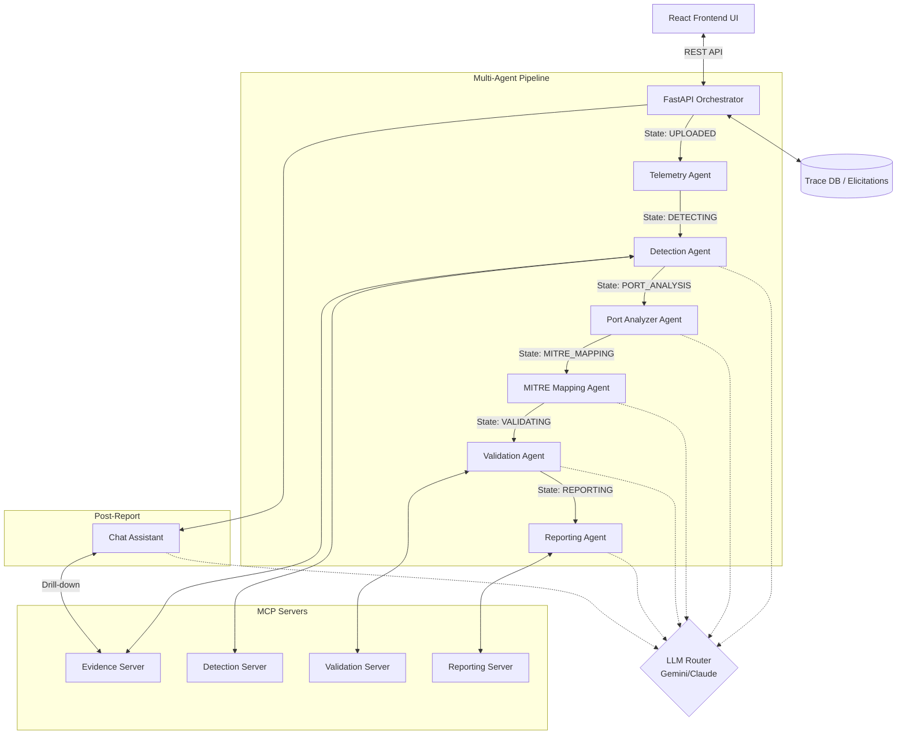
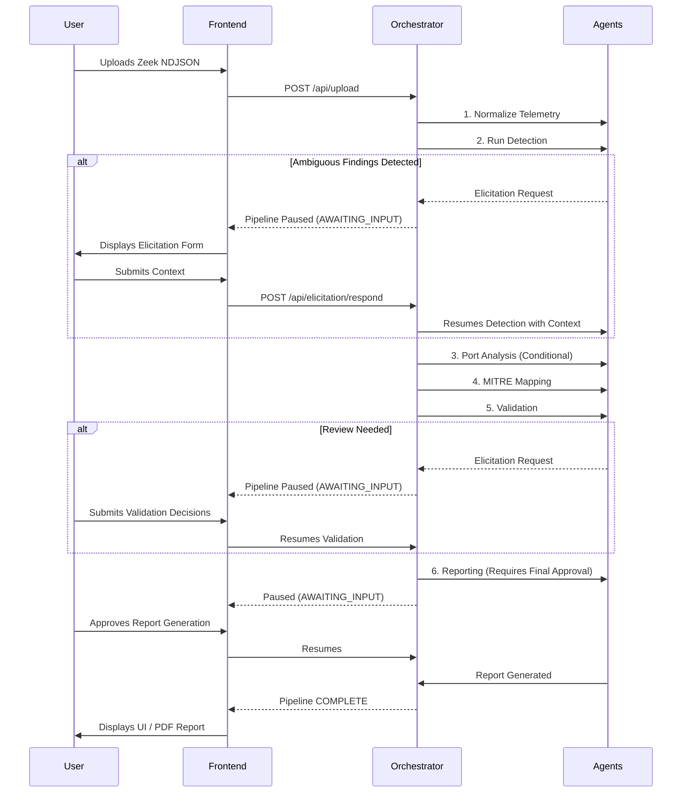

# Agentic SOC Telemetry Analyzer

A next-generation, AI-driven Security Operations Center (SOC) platform designed to autonomously analyze network telemetry, detect anomalies, validate findings, and generate comprehensive incident reports. Built with a Multi-Agent Architecture leveraging the Model Context Protocol (MCP) and featuring a dynamic Human-in-the-Loop (HITL) workflow.

## Main Goal
The primary objective of this project is to automate the initial triage and deep analysis phases of a SOC analyst's workflow. By feeding raw network telemetry (e.g., Zeek NDJSON logs) into an autonomous pipeline of specialized LLM-backed agents, the system can rapidly identify malicious behavior, map it to the MITRE ATT&CK framework, filter out false positives, and produce an executive-ready report. It integrates human judgment dynamically whenever ambiguous situations require analyst input.

---

## System Architecture

The architecture consists of a React frontend and a FastAPI backend orchestrator that manages a pipeline of specialized agents. These agents communicate with independent MCP (Model Context Protocol) servers that expose specific tools and prompts.



### LLM Routing
The system implements an environment-aware `LLMRouter`. Based on the `.env` configuration, the system routes requests to:
- **Dev Environment**: Gemini or Groq models for fast, cost-effective testing.
- **Prod Environment**: Claude Opus models for deep, advanced reasoning.

---

## Key Components

### Agents
Each agent has a highly specific role in the pipeline and utilizes LLMs to reason about the data.
1. **Telemetry Agent**: Normalizes raw input logs (e.g., Zeek) into a standard JSON schema format suitable for analysis.
2. **Detection Agent**: Analyzes normalized events to find suspicious patterns (e.g., beaconing, data exfiltration, lateral movement). Uses both deterministic heuristics and LLM reasoning.
3. **Port Analyzer Agent**: Deep-dives into abnormal port usages identified during detection.
4. **MITRE Mapping Agent**: Maps identified anomalous behaviors and TTPs to the standard MITRE ATT&CK matrix (Tactics and Techniques).
5. **Validation Agent**: Cross-references findings against known environments to reduce false positives. Evaluates confidence levels and flags items that need human review.
6. **Reporting Agent**: Aggregates all validated findings, MITRE mappings, and human decisions into a cohesive, structured incident report in Markdown and PDF formats.

### MCP Servers
The project uses the Model Context Protocol to separate tooling logic from the agent reasoning loop.
- **Evidence Server**: Provides tools to read and query the ingested network telemetry data.
- **Detection Server**: Exposes heuristic rules and detection prompts.
- **Validation Server**: Provides tools for deterministic verification of findings.
- **Reporting Server**: Exposes report generation templates and file-saving tools.

---

## End-to-End Process Flow

The pipeline executes sequentially. At specific decision points, the pipeline may pause to ask the analyst for input (Human-in-the-Loop).



### Human-in-the-Loop (HITL) Elicitation
The system operates semi-autonomously. Whenever an agent encounters missing context, an ambiguous finding, or a critical decision point (e.g., asset criticality, expected external IPs, low-confidence anomalies), it pauses the pipeline via the `ElicitationManager`.
- **5-Minute Timeout**: The analyst has 5 minutes to respond. If no response is received, the pipeline safely terminates to free up resources.
- **Audit Trail**: Every human decision is recorded and appended to the final "Human validation" section of the report.

### Post-Report Conversational Assistant
Once the final report is generated, the UI unlocks a Conversational Assistant panel.
- **Context-Aware**: The assistant has deep knowledge of the current report, all findings, validation results, and agent communication traces.
- **Strict Scope**: It cannot access external data or past reports, ensuring strict data boundaries. It refuses to speculate.
- **MCP Drill-down**: If an analyst asks for evidence (e.g., "What packets triggered Finding #2?"), the Chat Assistant queries the Evidence MCP Server in real-time to retrieve the raw NDJSON logs supporting the claim.

---

## Local Development & Deployment

### Prerequisites
- Python 3.10+
- Node.js 18+
- API Keys for the LLM providers you intend to use (Anthropic, Gemini, Groq)

### 1. Environment Setup

Clone the repository and set up your `.env` file in the root directory.

```bash
# .env file configuration
ENVIRONMENT=dev

# LLM API Keys
ANTHROPIC_API_KEY=your_claude_key_here
GEMINI_API_KEY=your_gemini_key_here
GROQ_API_KEY=your_groq_key_here
```

### 2. Backend Setup (FastAPI)

Navigate to the project root and install the dependencies.

```bash
# Create a virtual environment
python -m venv venv
source venv/bin/activate  # On Windows use: venv\Scripts\activate

# Install dependencies
pip install -r requirements.txt

# Run the FastAPI server
uvicorn src.api.main:app --host 0.0.0.0 --port 8000 --reload
```
The backend API will be available at `http://localhost:8000`.

### 3. Frontend Setup (React/Vite)

Open a new terminal window, navigate to the `frontend` directory, install Node dependencies, and start the development server.

```bash
cd frontend

# Install dependencies
npm install

# Start the Vite development server
npm run dev
```
The frontend UI will be available at `http://localhost:5173` (or whichever port Vite assigns).

### Usage
1. Open the React UI in your browser.
2. Drag and drop a `Zeek NDJSON` log file into the "Input Telemetry" zone.
3. Watch the Orchestrator State progress through the pipeline.
4. Interact with the **Elicitation Modals** when the system pauses for your input.
5. Review the final generated report in the UI or download it as a PDF.
